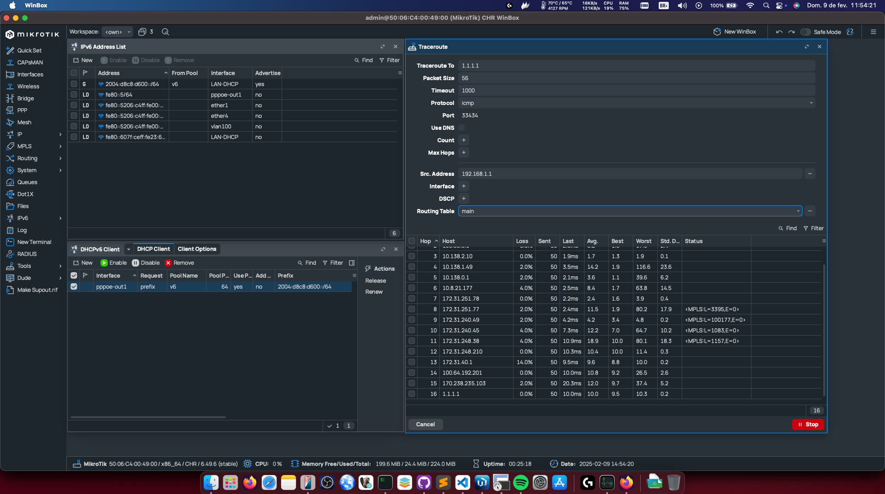
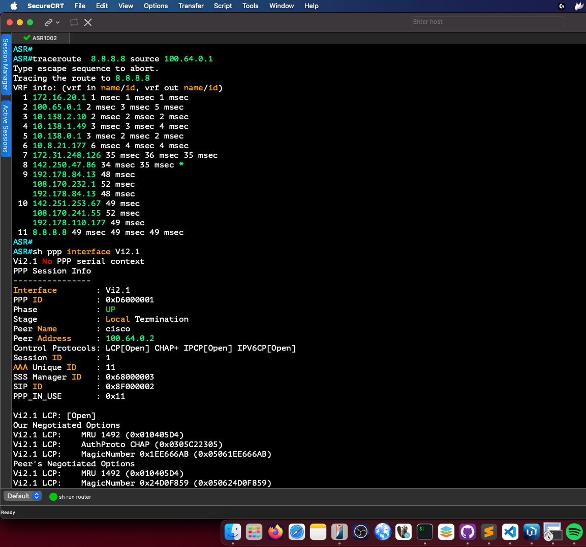

# Configuração do Cisco ASR 1000

Este repositório documenta a configuração de um roteador **Cisco ASR 1000**, incluindo interfaces, NAT, PPPoE, e IPv6. 

    Configuração de interfaces para comunicação LAN e WAN.
    Habilitação de suporte a IPv6 e configuração de um servidor DHCPv6-Stateless (SLAAC).
    Implementação de PPPoE para autenticação e gerenciamento de conexões de clientes.
    Definição de rotas estáticas para IPv4 e IPv6.
    Configuração de NAT para permitir a saída da rede privada para a internet.

## Configuração da Interface

### Configuração basica para discagem Local PPPoE
```cisco
    no ip domain lookup
    aaa session-id common
    aaa new-model
    username 12345 privilege 0 password 0 12345
    aaa authentication enable default none
    aaa authentication ppp default local
```

### Interface Loopback0
```cisco
interface Loopback0
 ip address 100.64.0.1 255.255.255.255
 ipv6 address 2004:D8C8:D700::1/40
 ipv6 enable
```

### Interface WAN (GigabitEthernet1)
```cisco
interface GigabitEthernet1
 description WAN
 ip address 172.16.20.255 255.255.252.0
 ip nat outside
 negotiation auto
```

### Interface VLAN para PPPoE (GigabitEthernet4.100)
```cisco
interface GigabitEthernet4.100
 encapsulation dot1Q 100
 pppoe enable group PPP
```

## Configuração de IPv6

Habilitando roteamento IPv6:
```cisco
ipv6 unicast-routing
ipv6 dhcp binding track ppp
```

Criando um pool DHCPv6:
```cisco
ipv6 dhcp pool dhcp-v6
 prefix-delegation pool pool-pd-v6
 dns-server 2001:4860:4860::8888
 dns-server 2001:4860:4860::8844
```
## Configuração de BBA-GROUP
```cisco    
    bba-group pppoe PPP
    virtual-template 1
    sessions per-mac limit 1
    sessions per-vlan limit 10000
```    
## Configuração de PPPoE

```cisco
interface Virtual-Template1
 description profile-pppoe
 mtu 1492
 ip unnumbered Loopback0
 ip nat inside
 ip tcp adjust-mss 1452
 no logging event link-status
 peer default ip address pool nat-1
 peer default ipv6 pool pool-SLAACv6
 ipv6 unnumbered Loopback0
 ipv6 enable
 ipv6 mtu 1480
 ipv6 nd other-config-flag
 no ipv6 nd ra suppress
 ipv6 tcp adjust-mss 1432
 ipv6 dhcp server dhcp-v6
 keepalive 30
 ppp authentication chap pap
 ppp ipcp dns 8.8.8.8 8.8.4.4
 ppp timeout authentication 15
```

## Configuração de Roteamento IPv6

```cisco
ipv6 route 2004:D8C8:D600::/49 Null0
ipv6 route 2004:D8C8:D700::/49 Null0
ipv6 local pool pool-pd-v6 2004:D8C8:D600::/49 64
ipv6 local pool pool-SLAACv6 2004:D8C8:D700::/49 64
```

## Configuração de Roteamento IPv4

```cisco
ip route 0.0.0.0 0.0.0.0 172.16.20.1 name GW-REDE-LOCAL-DHCP
```

## Configuração de NAT

Definição da ACL de NAT:
```cisco
ip access-list standard acl-nat-1
 permit 100.64.0.0 0.0.0.255
```

Criação do pool de endereços NAT:
```cisco
ip local pool nat-1 100.64.0.2 100.64.0.254
ip nat settings mode cgn
no ip nat settings support mapping outside
ip nat inside source list acl-nat-1 interface GigabitEthernet1 overload
```

Ativando o encaminhamento de pacotes ND:
```cisco
ip forward-protocol nd
```

## Conclusão

Esta configuração permite a operação de um roteador **Cisco ASR linha 100x** para conexões PPPoE com NAT e suporte a IPv6. Ajustes podem ser necessários conforme o ambiente de rede. Leve em consideração com as configurações apresentadas são o minimo que você precisará para ter um ambiente funcional.

Questões como Segurança otimização de desempenho e outras boas praticas na implementação disso não foram abordadas.


## TESTES REALIZADOS EM LABORATÓRIO





